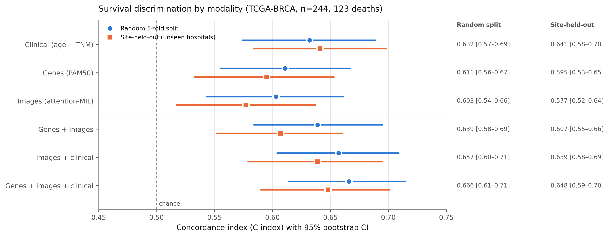
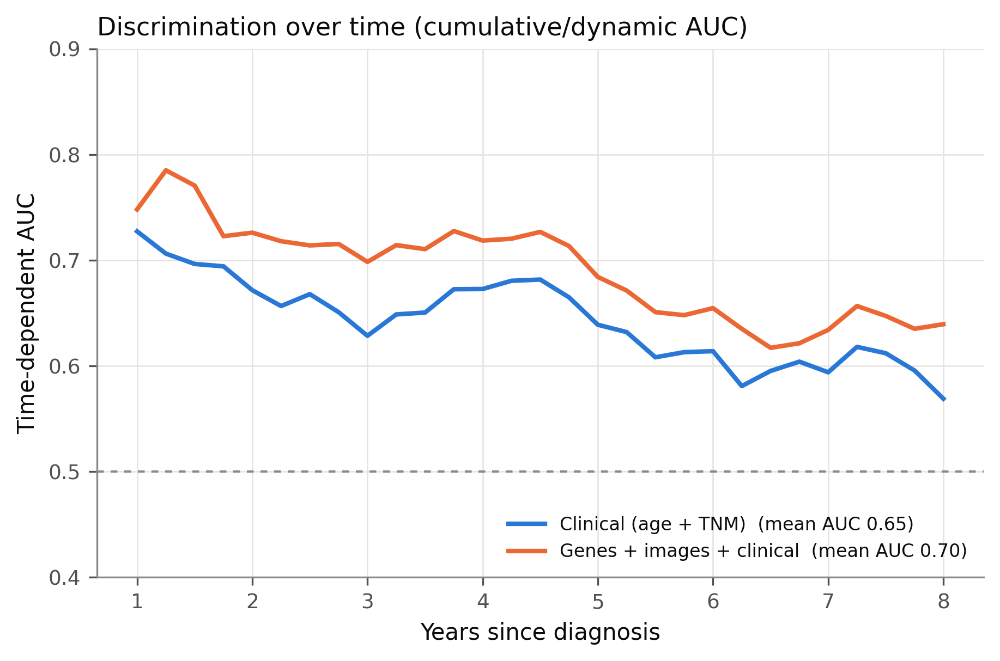
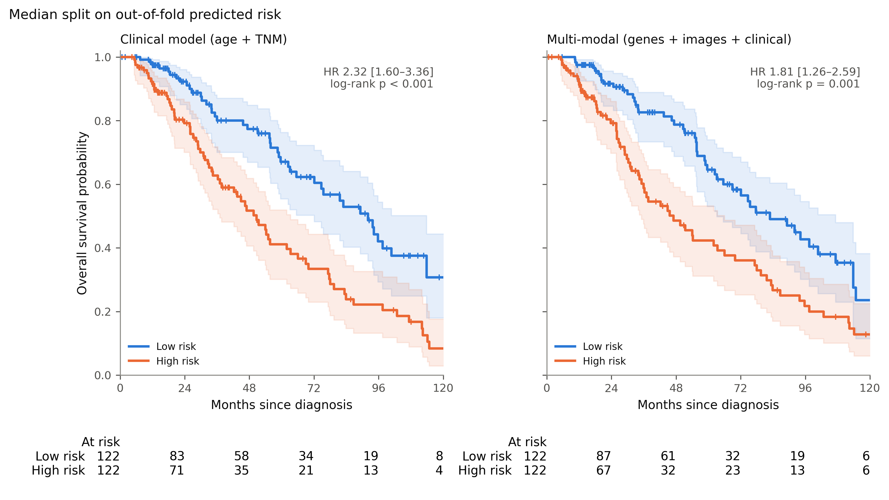
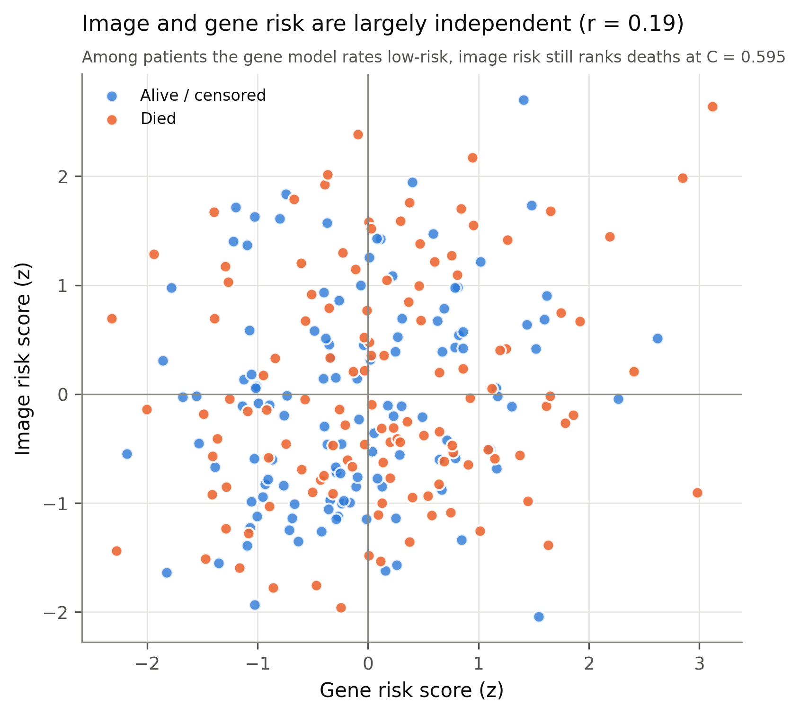

# 🧬🔬 Multi-Modal Breast-Cancer Prognosis

### Does combining a tumor's **genes**, its **microscope slide**, and **clinical staging** predict survival better than staging alone?


> A reproducible machine-learning study of breast-cancer survival that combines tumor **gene expression**, **whole-slide histopathology**, and **clinical staging** — validated across independent cohorts and unseen hospitals, built entirely on public data, with a pre-registered plan and honest reporting.
>
> **Researcher:** Shiv Prahalathan · 2026
> **Status:** Stages A–J complete on a 244-patient cohort · paper figures done · full 1,033-patient TCGA-BRCA run in progress

---

## 📌 TL;DR

On 244 TCGA-BRCA patients from 25 hospitals, a late-fusion model of genes + whole-slide images + clinical staging reached a **C-index of 0.666** (**0.660 ± 0.008** across 5 seeds) versus **0.632 for clinical staging alone**. It held up on hospitals it never trained on (**0.648**) and passed a shuffled-label leakage check. The gain over staging (+0.034) is a consistent trend that is **not yet statistically significant**.

## ✨ Highlights

- 🏥 **Generalizes to unseen hospitals** — site-held-out C-index **0.648** for the full model; every model's confidence interval stays above chance.
- 🔁 **Cross-cohort gene validation** — trained on METABRIC (microarray), tested on TCGA (RNA-seq): **0.652**.
- 🛡️ **Leakage and stability checks** — shuffled survival labels drop every model to 0.45–0.53 (chance); 5 random seeds give 0.660 ± 0.008; all headline numbers reproduce exactly from a fresh run.
- ⏱️ **Stays ahead of staging over time** — time-dependent AUC **0.696 vs 0.649**, largest at 3 years (0.70 vs 0.63).
- 🧩 **Complementary signals** — image risk and gene risk correlate only **r = 0.19**; among patients the gene model calls low-risk, image risk still ranks deaths at **C = 0.595**.
- 🔬 **Caught a confound** — a naive imaging model scored 0.907 because slide file size tracked outcome; size-matched sampling removed it (size alone → 0.496).
- 🧠 **Method matters** — generic ImageNet features found nothing (0.504); a pathology foundation model (Phikon) with attention-MIL found real signal (0.603).

## ❓ The Question

> Can machine learning predict breast-cancer survival from gene expression and histopathology, does it generalize beyond its training data, and does it add anything beyond the clinical staging doctors already use?

## 📊 Data (100% public)

| Dataset | Modality | Size | Role |
|---|---|---|---|
| **METABRIC** | gene expression (microarray) + survival | ~1,980 patients | Gene-model training |
| **TCGA-BRCA** | gene expression (RNA-seq) + clinical + survival | ~1,069 patients | Gene external validation |
| **TCGA-BRCA slides** | diagnostic whole-slide images (GDC) | 244 patients (size-matched) → 1,033 (in progress) | Imaging survival + fusion |
| **BreakHis** | histopathology images | ~9,000 images | Image classifier (pipeline check) |

Provenance and citations: [`docs/DATA_SOURCES.md`](docs/DATA_SOURCES.md).

## ⚙️ Methods

- **Survival models:** Cox proportional hazards (clinical, genes); 5-fold out-of-fold **C-index** with 95% bootstrap CIs (0.5 = chance).
- **Imaging:** each slide is cut into up to 200 tissue tiles → **Phikon** pathology-model embeddings (768-d per tile) → **gated attention-MIL** with a Cox head, which learns which tiles matter.
- **Fusion:** **late fusion** — the sum of z-scored risk scores from separately trained arms.
- **Validation:** random 5-fold · **leave-site-out** (GroupKFold over 25 hospitals, so test hospitals are never seen in training) · METABRIC → TCGA for genes.
- **Integrity:** shuffled-label negative control, 5-seed stability, slide-size confound gate, pre-registered plan ([`PREREGISTRATION.md`](PREREGISTRATION.md)), and a dated [`LAB_NOTEBOOK.md`](LAB_NOTEBOOK.md) entry for every step.

## 📈 Results (TCGA-BRCA, n = 244, 123 deaths, 25 hospitals)



| Model | Random 5-fold | Unseen hospitals |
|---|---|---|
| Clinical (age + TNM) | 0.632 [0.57–0.69] | 0.641 [0.58–0.70] |
| Genes (PAM50) | 0.611 [0.56–0.67] | 0.595 [0.53–0.65] |
| Images (Phikon + attention-MIL) | 0.603 [0.54–0.66] | 0.577 [0.52–0.64] |
| Genes + images | 0.639 [0.58–0.69] | 0.607 [0.55–0.66] |
| Images + clinical | 0.657 [0.60–0.71] | 0.639 [0.58–0.69] |
| **Genes + images + clinical** | **0.666 [0.61–0.72]** | **0.648 [0.59–0.70]** |

Full model vs clinical alone: **ΔC = +0.034, 95% CI [−0.017, +0.086]** — a trend, not significant at this sample size.

| Discrimination over time | Kaplan-Meier risk groups |
|---|---|
|  |  |



Cohort characteristics: [`results/table1_cohort.md`](results/table1_cohort.md) · all metrics: [`results/`](results/)

**Earlier stages:** gene model METABRIC → TCGA **0.652**; the full ~20,000-gene transcriptome did no better than the 50-gene PAM50 panel (~0.60); BreakHis benign-vs-malignant classifier **AUC 0.84**.

## ⚠️ Limitations

- The improvement over clinical staging is **not statistically significant** at n = 244.
- On a simple high/low split, **staging separates survival more sharply** than the full model (HR 2.32 vs 1.81, Fig 3); the multi-modal gain shows up in finer ranking (C-index, time-AUC).
- The 244-patient cohort is **50% deaths by design** (size-matched case/control) versus ~14% in TCGA overall — the full 1,033-patient run addresses this.
- "Unseen hospitals" are still within TCGA; no independent public breast cohort has slides + genes + survival (CPTAC-BRCA lacks follow-up).
- The headline 0.666 is one seed; the 5-seed mean is 0.660.
- Observational data → **associations, not causation**. A research model, **not a clinical tool**.

## 🗂️ Repository Structure

```
├── README.md · LAB_NOTEBOOK.md · PREREGISTRATION.md · PUBLICATION_ROADMAP.md · STUDY_GUIDE.md
├── REPORT.md                  # early write-up (July, pre-n=244) — superseded by the lab notebook
├── config.py                  # studies, gene panel, seed
├── src/
│   ├── fetch_data.py · eda.py            # public data + survival-by-subtype
│   ├── model.py · validate_external.py   # Stage A: gene survival + METABRIC→TCGA validation
│   ├── boost_genes.py                    # Stage A+: full transcriptome vs PAM50
│   ├── stage_c_local.py · stage_c_parallel.py   # Stage C: slide download + ResNet features
│   ├── stage_c_pathology.py              # Stage C: Phikon tile features (--all = full cohort)
│   ├── stage_cd.py                       # Stage C/D: confound gate + fusion
│   ├── stage_e_attmil.py                 # Stage E: attention-MIL survival
│   ├── stage_f_redundancy.py · stage_g_latefusion.py   # Stages F–G: complementarity, late fusion
│   ├── stage_h_clinical.py · stage_i_leavesite.py      # Stages H–I: clinical baseline, unseen hospitals
│   ├── stage_j_metrics.py · make_figures.py            # Stage J: robustness, metrics, paper figures
├── notebooks/                 # Colab notebooks (BreakHis classifier, slide pipeline)
├── docs/                      # script docs, data sources, Colab guides
└── results/                   # metrics, cached out-of-fold predictions, figures
```

## ▶️ Reproduce It

```bash
git clone https://github.com/Aeronite-P/breast-cancer-prognosis.git
cd breast-cancer-prognosis
python3 -m venv .venv && source .venv/bin/activate
pip install -r requirements.txt

python src/fetch_data.py          # public gene + clinical data (cBioPortal)
python src/model.py               # Stage A gene survival models
python src/validate_external.py   # METABRIC → TCGA validation
python src/stage_c_pathology.py   # download slides + Phikon tile features (~270 GB, resume-safe)
python src/make_figures.py        # all survival models, robustness checks, figures, Table 1
```

## 🗺️ Roadmap

- [x] **A** — gene survival model + cross-cohort validation
- [x] **B** — histopathology image classifier (BreakHis)
- [x] **C** — imaging survival (confound caught and fixed; Phikon + attention-MIL)
- [x] **D–G** — fusion, complementarity, late fusion
- [x] **H–J** — clinical baseline, unseen-hospital validation, robustness, paper figures
- [ ] Full 1,033-patient TCGA-BRCA cohort (running)
- [ ] Attention heatmaps · calibration · manuscript — see [`PUBLICATION_ROADMAP.md`](PUBLICATION_ROADMAP.md)

## 📚 Citation & Data

Please cite the source studies — METABRIC (Curtis et al. 2012; Pereira et al. 2016), TCGA-BRCA, BreakHis (Spanhol et al. 2016) — along with cBioPortal (Cerami et al. 2012; Gao et al. 2013), Phikon (Filiot et al. 2023), and attention-based MIL (Ilse et al. 2018). See [`docs/DATA_SOURCES.md`](docs/DATA_SOURCES.md).

## 📄 License

MIT — see [`LICENSE`](LICENSE).
